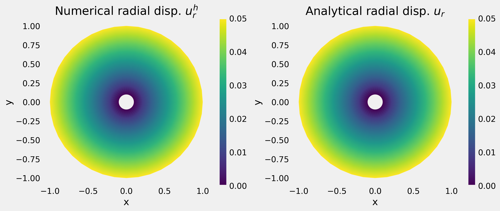

## FEM

  

&nbsp;\
**Galerkin Finite Element Implementation of Quasi-static Linearized Elasticity**
> Submitted as a final project for the Finite Element Methods course offered by Professor K.B. Nakshatrala at the University of Houston.

&nbsp;\
The primary objective of this project is to demonstrates the robustness and edge-case behaviors of the developed finite-element methods across various
problem settings, including canonical problems with known analytical solutions and those without analytical solutions.

### Experimental Results
All of these experimental details are presented in the notebook. You can access them here:
[Taiwo_FEM_with_KBN_Final_Project](./taiwo_final_project_main.ipynb).

### The Author
Taiwo Adebiyi is a PhD Candidate at the University of Houston and enrolled in the Finite Element Methods (CIVE 7336) course instructed 
by Professor K.B. Nakshatrala of the Department of Civil and Enviromental Engineering.
